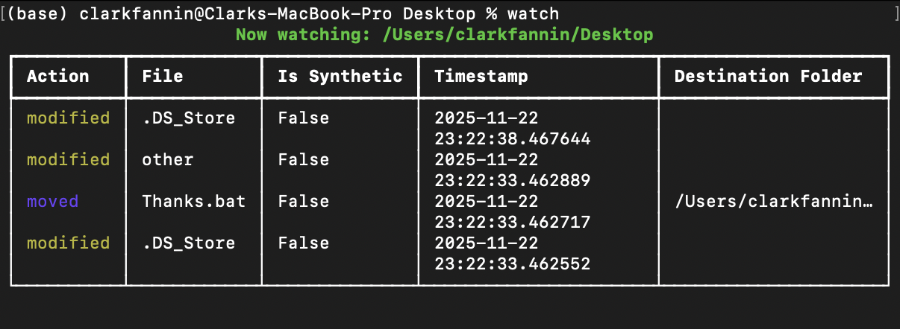

# pthui

## Description

pthui is a tiny, color-coded TUI wrapper for watchdog. Install it globally and use it from anywhere!


## Prerequisites

Make sure you have Python, [watchdog](https://pypi.org/project/pthuidog/) and [rich](https://pypi.org/project/rich/) installed:

```bash
pip install rich watchdog
```

## Installing globally

### macOS / Linux

To run the script from anywhere:

1. Clone the repo:

```bash
git clone https://github.com/clarkfannin/pthui
```

2. Make `tui.py` executable:

```bash
chmod +x /path/to/tui.py
```

3. Create a symlink in a folder that's in your `PATH`:

```bash
sudo ln -s /path/to/tui.py /usr/local/bin/pthui     # optional: replace 'pthui' with whatever command you want
```

After that, you can run:

```bash
pthui                # watches the current folder
pthui /some/folder   # watches a specific folder
```

### Windows

1. Clone the repo:

```bash
git clone https://github.com/clarkfannin/pthui
```

2. Make sure Python and pthui.bat are somewhere on your PATH.

3. Run it with:

```powershell
pthui                       # watches current folder
pthui C:\path\to\folder     # watches a specific folder
```

## Usage

The `pthui` command takes a pathname as an optional argument:

```bash
pthui /path/to/folder
```

Set `simple=False` in `tui.py` to enable more detailed monitoring.




Set `export=True` in `tui.py` to export the output to HTML. Output will be saved to the current working directory.

Enter Ctrl+C to end monitoring.
